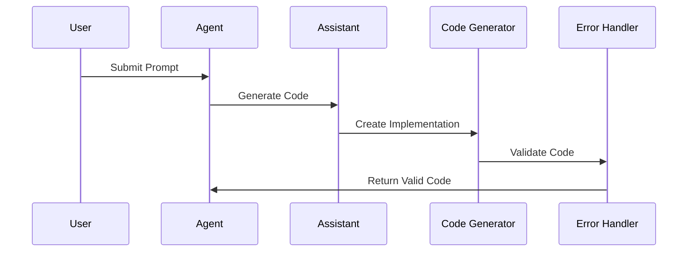
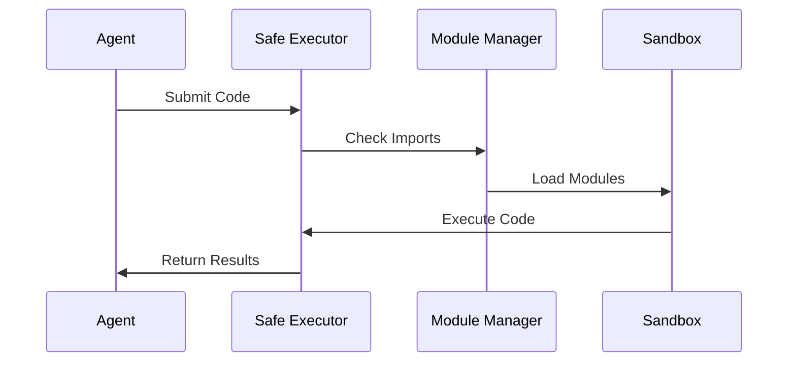

# Crypto Trading Multi-Agent System

## Quick Start

1. One-line deployment:
```bash
./deploy.sh
```

2. Monitor all agents:
```bash
./monitor.sh
```

## Deployment Options

### 1. Docker Compose Deployment (Recommended)
```bash
# Start all services
docker-compose up -d

# Check deployment status
docker-compose ps

# View logs of all agents
docker-compose logs -f
```

### 2. Individual Service Deployment
```bash
# Start specific services
docker-compose up -d redis
docker-compose up -d strategy_finder
docker-compose up -d market_analyzer
docker-compose up -d strategy_executor
docker-compose up -d dashboard
```

## Monitoring Tools

### 1. Web Dashboard
Access at http://localhost:5000
- Real-time agent status
- Live strategy updates
- Market analysis feed
- Performance metrics

### 2. CLI Monitoring
```bash
# Monitor all agents
./scripts/monitor_agents.py

# Monitor specific agent
./scripts/monitor_agents.py --agent strategy_finder
```

### 3. Docker Logs
```bash
# All agents
docker-compose logs -f

# Specific agent
docker-compose logs -f strategy_finder
```

### 4. Redis Monitor
```bash
# Monitor all Redis events
docker-compose exec redis redis-cli monitor

# Monitor specific channels
docker-compose exec redis redis-cli psubscribe "*"
```

## Health Checks

### 1. API Endpoint
```bash
curl http://localhost:5000/health
```

### 2. Container Status
```bash
docker-compose ps
```

### 3. Resource Usage
```bash
docker stats
```

## Features

- Three-agent collaboration system
- Multiple trading strategies:
  - SMA (Simple Moving Average)
  - MACD + RSI + Bollinger Bands
  - Pump Detection
  - Dump Detection
- Real-time market analysis
- Automated strategy selection
- Risk management integration
- Built on AutoGen 0.4 framework
- Real-time console output of agent interactions

## Prerequisites

- Python 3.8+
- OpenAI API key
- Access to crypto market data

## Installation

1. Clone this repository:
```bash
git clone <repository-url>
cd <repository-name>
```

2. Install the required packages:
```bash
pip install -r requirements.txt
```

3. Set up your OpenAI API key:
   - Open `main.py`
   - Replace `YOUR_API_KEY` with your actual OpenAI API key

## Docker Deployment

1. Set your OpenAI API key in your environment:
```bash
export OPENAI_API_KEY=your_api_key_here
```

2. Build and start the containers:
```bash
docker-compose up -d
```

3. Monitor the agents:
```bash
# View all container logs
docker-compose logs -f

# View specific agent logs
docker-compose logs -f strategy_finder
docker-compose logs -f market_analyzer
docker-compose logs -f strategy_executor
```

## System Architecture

### Container Architecture
```
┌─────────────────┐     ┌─────────────────┐     ┌─────────────────┐
│ Strategy Finder │     │ Market Analyzer │     │Strategy Executor│
│    Container    │     │    Container    │     │    Container    │
└────────┬────────┘     └────────┬────────┘     └────────┬────────┘
         │                       │                        │
         │                       │                        │
         └───────────┬──────────┴────────────┬──────────┘
                     │                       │
              ┌──────┴───────┐       ┌──────┴───────┐
              │    Redis     │       │    Shared    │
              │  Container   │       │    Volume    │
              └──────────────┘       └──────────────┘
```

### Inter-Agent Communication
- Redis pub/sub for real-time updates
- Shared state management
- Event-driven architecture

### Monitoring and Maintenance

1. Check agent status:
```bash
docker ps --format "table {{.Names}}\t{{.Status}}\t{{.State}}"
```

2. Redis CLI access:
```bash
docker-compose exec redis redis-cli
```

3. View agent messages:
```bash
# In Redis CLI
SUBSCRIBE market_analysis execution_results execution_errors
```

4. Container Management:
```bash
# Restart specific agent
docker-compose restart strategy_finder

# Stop all containers
docker-compose down

# Remove all containers and volumes
docker-compose down -v
```

## Configuration

### Environment Variables
- `AGENT_INTERVAL`: Time between agent runs (seconds)
- `REDIS_HOST`: Redis connection host
- `REDIS_PORT`: Redis connection port
- `OPENAI_API_KEY`: Your OpenAI API key

### Agent-Specific Settings
Each agent can be configured in docker-compose.yml:
```yaml
strategy_finder:
  environment:
    - AGENT_INTERVAL=60  # Check market every minute
```

## Troubleshooting

1. Container Issues:
```bash
# Check container logs
docker-compose logs --tail=100 [service_name]

# Restart all services
docker-compose restart
```

2. Redis Connection Issues:
```bash
# Check Redis connectivity
docker-compose exec redis redis-cli ping
```

3. Agent Communication Issues:
```bash
# Monitor Redis events
docker-compose exec redis redis-cli monitor
```

## Usage

Run the trading system:
```bash
python main.py
```

The agents will collaborate to:
1. Analyze market conditions (Market Analyzer)
2. Select appropriate trading strategy (Strategy Finder)
3. Execute and monitor the strategy (Strategy Executor)

## Architecture

### Strategy Finder Agent
- Analyzes market conditions and requirements
- Selects optimal trading strategy from available options
- Provides strategy configuration parameters
- Makes data-driven strategy recommendations

### Market Analyzer Agent
- Processes market data using technical indicators
- Identifies trading opportunities and risks
- Provides real-time market insights
- Monitors market conditions continuously

### Strategy Executor Agent
- Implements selected trading strategies
- Manages strategy configuration and initialization
- Executes trades with risk management
- Monitors and reports performance

## Available Trading Strategies

1. SMA Strategy
   - Uses Simple Moving Average crossovers
   - Configurable time windows
   - Trend following approach

2. MACD + RSI + Bollinger Bands
   - Combined technical indicator strategy
   - Multiple confirmation signals
   - Advanced market trend analysis

3. Pump Detection Strategy
   - Identifies potential market pumps
   - Volume and price spike analysis
   - Quick response to market movements

4. Dump Detection Strategy
   - Monitors for market dumps
   - Risk management focus
   - Recovery opportunity identification

## Monitoring Dashboard

The system includes a real-time web-based monitoring dashboard accessible at http://localhost:5000

### Dashboard Features
- Real-time agent status monitoring
- Live log streaming for each agent
- Error tracking and visualization
- Strategy execution results
- Market analysis updates

### Starting the Dashboard
```bash
# Start with other services
docker-compose up -d

# Start dashboard separately
docker-compose up -d dashboard
```

### Dashboard Sections

1. Strategy Finder Panel
   - Current strategy recommendations
   - Strategy selection reasoning
   - Market condition assessments

2. Market Analyzer Panel
   - Live market analysis results
   - Technical indicator readings
   - Market opportunity signals

3. Strategy Executor Panel
   - Active strategy status
   - Execution results
   - Performance metrics
   - Error logs

## Contributing

Contributions are welcome! Please feel free to submit issues and enhancement requests.

## License

[MIT License](LICENSE)

## Disclaimer

This software is for educational purposes only. Cryptocurrency trading carries significant risks. Always conduct your own research and risk assessment before trading.

# Trading Agent Digital Ocean Deployment

## Prerequisites

1. Digital Ocean account
2. Docker Hub account
3. SSH key pair
4. Domain name (optional)

## Quick Deployment

1. Create a Digital Ocean droplet:
   - Ubuntu 20.04 LTS
   - Basic plan ($5-$10/month)
   - Add your SSH key

2. Configure deployment:
   ```bash
   # Edit deploy.sh with your details
   DOCKER_USERNAME="your_username"
   SSH_KEY="path/to/your/key"
   ```

3. Deploy:
   ```bash
   ./deploy.sh your_droplet_ip
   ```

4. Monitor:
   ```bash
   ./monitor.sh your_droplet_ip
   ```

## Monitoring Options

1. Web Dashboard: `http://your_droplet_ip:8080`
2. System Metrics: `http://your_droplet_ip:19999`
3. CLI Monitoring: `./monitor.sh your_droplet_ip`
4. Direct Logs: `ssh root@your_droplet_ip 'docker-compose logs -f'`

## Maintenance

1. Update agent:
   ```bash
   ./deploy.sh your_droplet_ip
   ```

2. Restart services:
   ```bash
   ssh root@your_droplet_ip 'cd trading-agent && docker-compose restart'
   ```

3. View logs:
   ```bash
   ssh root@your_droplet_ip 'cd trading-agent && docker-compose logs -f'
   ```

## Security Notes

- Only necessary ports are exposed (22, 8080, 19999)
- UFW firewall enabled
- Regular system updates
- Container resource limits enforced

## Backup

Data is persisted in Docker volumes. To backup:
```bash
ssh root@your_droplet_ip 'cd trading-agent && ./backup.sh'
```

## Troubleshooting

1. Check agent status:
   ```bash
   curl http://your_droplet_ip:8080/health
   ```

2. View system resources:
   ```bash
   ssh root@your_droplet_ip 'htop'
   ```

3. Check logs:
   ```bash
   ssh root@your_droplet_ip 'docker-compose logs --tail=100'
   ```

# Trading Agent Deployment

## Prerequisites

1. Docker and Docker Compose
2. GitHub Account
3. GitHub Personal Access Token with `read:packages` permission

## Quick Start

1. Clone the repository:
```bash
git clone https://github.com/your-username/trading-agent.git
cd trading-agent
```

2. Deploy:
```bash
./deploy.sh
```

3. Monitor:
```bash
./monitor.sh
```

## GitHub Container Registry Setup

1. Create a Personal Access Token:
   - Go to GitHub Settings → Developer Settings → Personal Access Tokens
   - Generate new token with `read:packages` permission
   - Save the token securely

2. The deployment script will prompt for your token on first run

## Monitoring

1. Web Dashboard: `http://localhost:8080`
2. Container Logs: `docker-compose logs -f`
3. Resource Usage: `docker stats`
4. Health Check: `curl http://localhost:8080/health`

## Maintenance

1. Update to latest version:
```bash
./deploy.sh --update
```

2. Stop all services:
```bash
docker-compose down
```

3. View logs:
```bash
docker-compose logs -f
```

## Troubleshooting

1. Check container status:
```bash
docker-compose ps
```

2. View specific service logs:
```bash
docker-compose logs strategy_manager
```

3. Restart services:
```bash
docker-compose restart
```

## Security Notes

- GitHub token is stored locally in `.github_token`
- Only necessary ports are exposed (6379, 8080)
- Container resources are limited
- Automatic restarts enabled

# Trading Agents DigitalOcean Deployment

## Prerequisites

1. [DigitalOcean Account](https://cloud.digitalocean.com)
2. [doctl](https://github.com/digitalocean/doctl#installing-doctl) installed
3. Docker and Docker Compose
4. SSH key added to DigitalOcean

## Quick Deployment

1. Configure DigitalOcean CLI:
```bash
doctl auth init
```

2. Deploy:
```bash
./deploy.sh
```

3. Monitor:
```bash
./do_monitor.sh
```

## Deployment Options

Edit `do.config` to customize:
- Droplet size
- Region
- Resource allocation
- Monitoring intervals

## Maintenance

1. Update agents:
```bash
./deploy.sh --update
```

2. Scale resources:
```bash
doctl compute droplet-action resize $DROPLET_ID --size s-4vcpu-8gb
```

3. Backup data:
```bash
./backup.sh
```

## Monitoring

1. Web Dashboard: `http://<droplet-ip>:5000`
2. Resource Usage: `./do_monitor.sh`
3. Logs: `ssh root@<droplet-ip> 'cd trading-agents && docker-compose logs -f'`

## Cost Optimization

- Use CPU-optimized droplets for strategy optimization
- Use regular droplets for monitoring and management
- Enable auto-shutdown during inactive periods

## Security Notes

- All ports except 22, 5000, and 8080 are closed
- UFW firewall enabled
- Regular security updates
- Encrypted communication

## Trading Modes

The system supports two modes of operation:

1. Live Trading
   - Requires Binance API keys
   - Real trading with actual funds
   - Full access to Binance API

2. Dry Run (Default)
   - No API keys required
   - Simulated trading with 10,000 USDT
   - Perfect for testing strategies
   - No real funds at risk

To switch modes:

1. For Dry Run (default):
   - Leave `BINANCE_API_KEY` and `BINANCE_API_SECRET` empty in config.env

2. For Live Trading:
   - Add your Binance API keys to config.env
   - System automatically switches to live mode

## LLM Model Configuration

The system supports multiple LLM providers and models:

### OpenAI Models
- GPT-4 (default)
- GPT-4-32k
- GPT-4-1106-preview
- GPT-4-vision-preview

Configure in config.env:
```bash
LLM_PROVIDER=openai
LLM_MODEL=gpt-4
OPENAI_API_KEY=your_api_key
```

### Agent-Specific Models
You can configure different models for each agent:
```bash
STRATEGY_FINDER_MODEL=gpt-4
MARKET_ANALYZER_MODEL=gpt-4-32k
OPTIMIZER_MODEL=gpt-4-1106-preview
```

### Model Parameters
Customize model behavior:
```bash
MODEL_MAX_TOKENS=8000
MODEL_TEMPERATURE=0.7
MODEL_TOP_P=0.95
```

## Code Executor Agent Architecture

### Overview Diagram
```
┌─────────────────────────────────────────┐
│            Code Executor Agent          │
├─────────────────────────────────────────┤
│                                         │
│  ┌─────────────┐       ┌─────────────┐  │
│  │   AutoGen   │       │    Safe     │  │
│  │  Assistant  │◄─────►│  Executor   │  │
│  └─────────────┘       └─────────────┘  │
│         ▲                    ▲          │
│         │                    │          │
│         ▼                    ▼          │
│  ┌─────────────┐       ┌─────────────┐  │
│  │    Code     │       │  Sandbox    │  │
│  │  Generator  │       │ Environment │  │
│  └─────────────┘       └─────────────┘  │
│         ▲                    ▲          │
│         │                    │          │
│         ▼                    ▼          │
│  ┌─────────────┐       ┌─────────────┐  │
│  │   Error     │       │  Module     │  │
│  │  Handler    │       │  Manager    │  │
│  └─────────────┘       └─────────────┘  │
│                                         │
└─────────────────────────────────────────┘
```

### Components

1. **AutoGen Assistant**
   - Handles code generation requests
   - Uses GPT-4 for code synthesis
   - Maintains conversation context
   - Provides code fixes when needed

2. **Safe Executor**
   - Executes code in isolated environment
   - Manages resource limits
   - Handles I/O redirection
   - Provides execution results

3. **Code Generator**
   - Generates implementation code
   - Creates test cases
   - Follows specified format
   - Handles code organization

4. **Sandbox Environment**
   - Restricted Python environment
   - Limited module access
   - Resource monitoring
   - Security controls

5. **Error Handler**
   - Catches execution errors
   - Provides detailed error context
   - Initiates code fixes
   - Maintains error logs

6. **Module Manager**
   - Manages allowed modules
   - Handles package installation
   - Validates imports
   - Controls module access

### Workflow

1. **Code Generation**


2. **Code Execution**


### Security Features

- Restricted module imports
- Sandboxed execution environment
- Resource limits enforcement
- Input validation
- Error isolation

### Configuration Options

```yaml
code_executor:
  model: "gpt-4"
  parameters:
    max_tokens: 2000
    temperature: 0.7
    timeout: 60
    sandbox_mode: true
    memory_limit: "256MB"
    cpu_limit: "0.2"
```

### Usage Example

```python
# Initialize agent
agent = CodeExecutorAgent(db=local_db, trading_mode=trading_mode)

# Execute code
response = agent.execute("""
    Write a Python function that:
    1. Calculates RSI
    2. Handles edge cases
    3. Includes tests
""")

# Get results
print(response)
```

### Error Handling

The agent implements a multi-layer error handling approach:
1. Code validation before execution
2. Runtime error catching
3. Automatic error recovery
4. Detailed error reporting

### Database Integration

- Logs all executions
- Tracks execution status
- Stores results and errors
- Maintains execution history

### Monitoring

Monitor the agent through:
1. Web Dashboard
2. Log Files
3. Database Queries
4. Health Checks